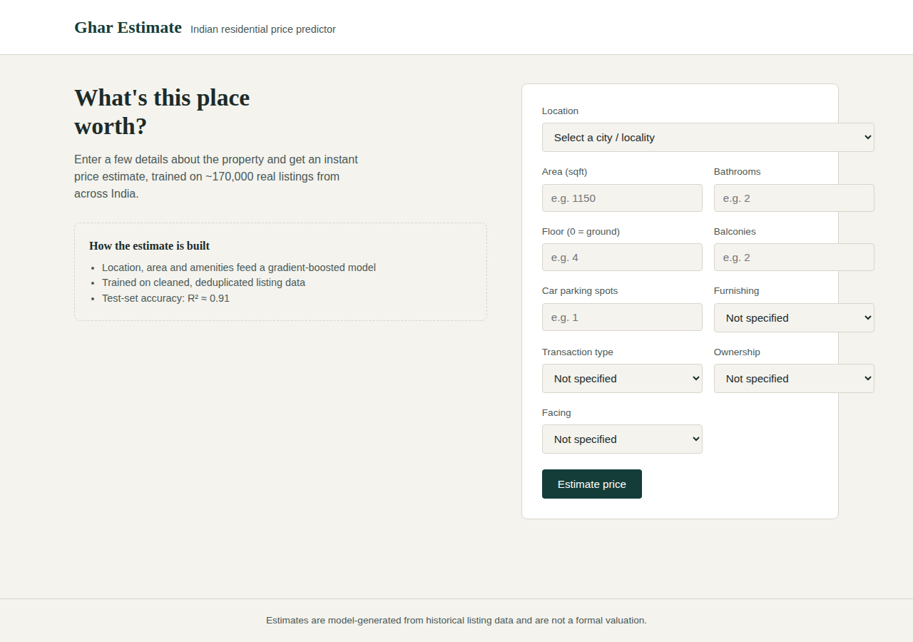
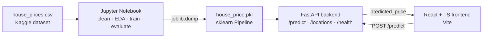
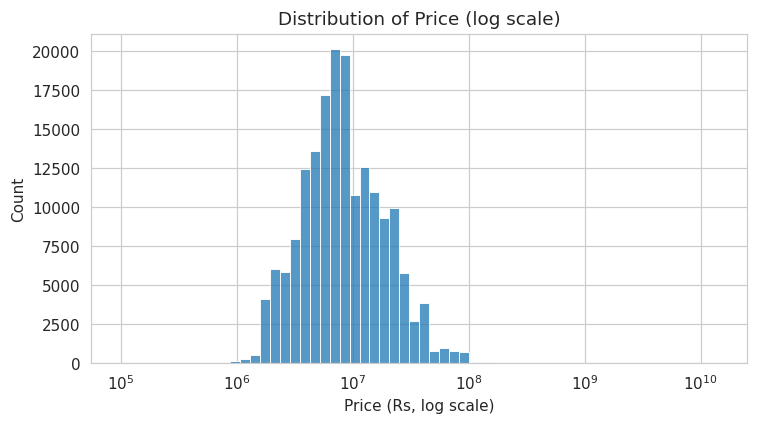
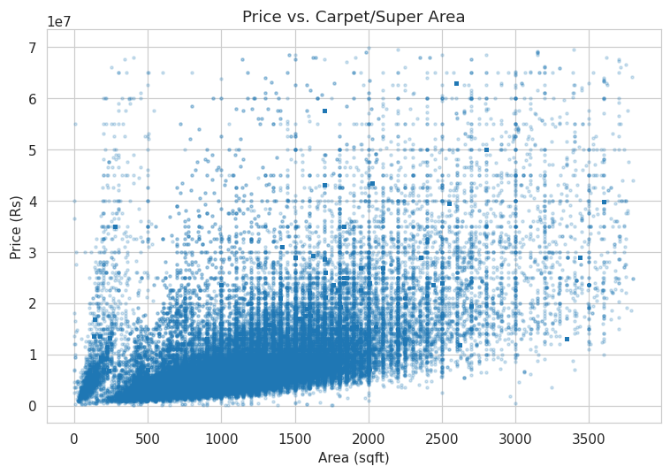
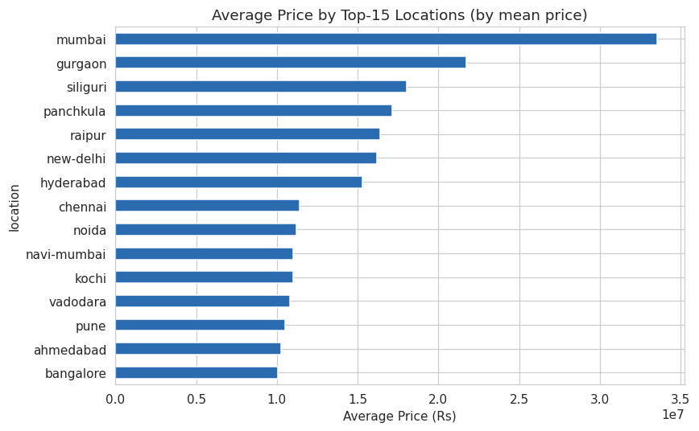
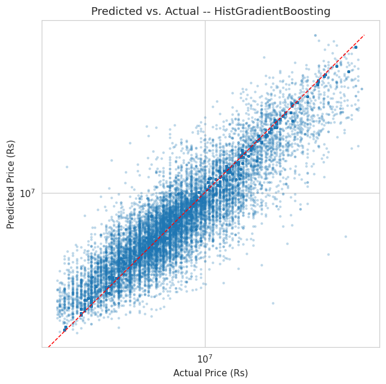
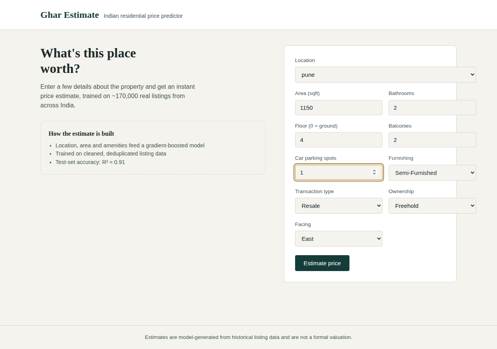
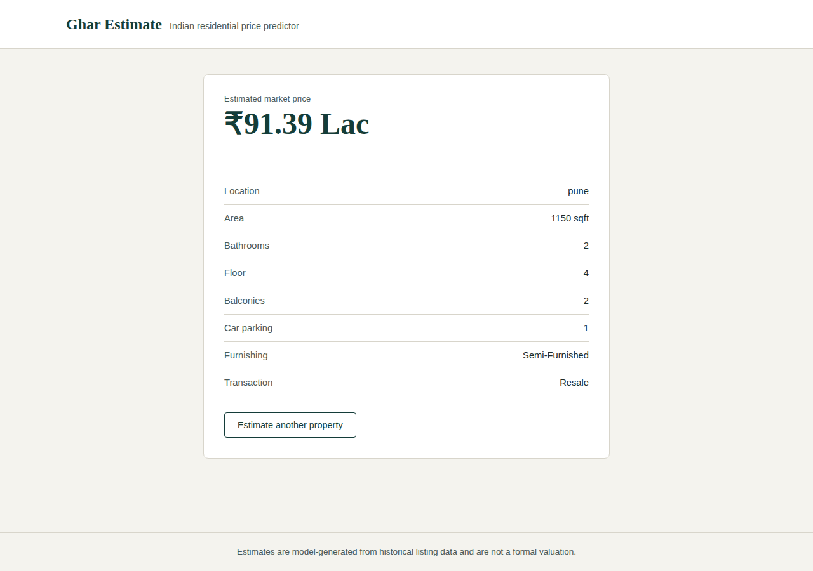

# Ghar Estimate — House Price Prediction (End-to-End ML Web App)

An end-to-end machine learning product that predicts residential property prices in India: a cleaned & modeled dataset, a FastAPI backend serving a trained scikit-learn pipeline, and a React + TypeScript frontend where a user enters property details and gets an instant price estimate.



## Overview

- **Dataset:** [House Price by Juhi Bhojani](https://www.kaggle.com/datasets/juhibhojani/house-price) (Kaggle) — ~187,500 real property listings scraped from across India.
- **Notebook:** cleans the (deliberately messy) raw data, explores it, engineers features, trains and compares 3 regression models, and exports the winner as a single self-contained scikit-learn `Pipeline`.
- **Backend:** a FastAPI service that loads that pipeline once at startup and serves predictions over a small JSON API.
- **Frontend:** a React + TypeScript app (Vite) where a user fills in a property's details and sees a formatted price estimate.

## Architecture



## Tech stack

| Layer      | Technology                                                        |
| ---------- | ------------------------------------------------------------------ |
| Modeling   | Python, pandas, scikit-learn, matplotlib/seaborn, Jupyter           |
| Backend    | FastAPI, Pydantic v2, Uvicorn, joblib                               |
| Frontend   | React 19, TypeScript, Vite 8, React Router                         |
| Packaging  | Docker (backend), plain static build (frontend)                    |

## Project structure

```
house-price-project/
├── notebooks/
│   ├── house_price_model.ipynb   # data cleaning, EDA, training, export (fully executed, with real outputs)
│   ├── data/house_prices.csv     # raw dataset (NOT committed — see "Get the dataset" below)
│   ├── house_price.pkl           # exported model (also copied into backend/models/)
│   ├── locations.json            # locations the model recognises
│   └── final_metrics.json        # metrics for every model trained, machine-readable
├── backend/
│   ├── app/
│   │   ├── main.py                     # FastAPI app, CORS, model loaded at startup (lifespan)
│   │   ├── api/routes/prediction.py    # GET /health, GET /locations, POST /predict
│   │   ├── core/config.py              # settings from .env (pydantic-settings)
│   │   ├── schemas/prediction.py       # PredictionRequest / PredictionResponse
│   │   ├── services/
│   │   │   ├── preprocessing.py        # turns a request into a one-row DataFrame
│   │   │   └── inference.py            # loads house_price.pkl, runs predict()
│   │   └── utils/logging_config.py
│   ├── models/house_price.pkl          # ← copied from the notebook
│   ├── tests/test_prediction.py        # 7 tests: happy paths + invalid-input (422) cases
│   ├── requirements.txt
│   ├── .env.example
│   └── Dockerfile
├── frontend/
│   ├── src/
│   │   ├── api/predictionClient.ts     # fetch wrapper, base URL from VITE_API_BASE_URL
│   │   ├── components/PredictionForm.tsx
│   │   ├── pages/{HomePage,ResultPage,NotFoundPage}.tsx
│   │   ├── types/prediction.ts         # TS types mirroring the backend schema
│   │   └── App.tsx                     # routes: / , /result , * (404)
│   └── .env.example
├── docs/images/                        # EDA plots + app screenshots used in this README
└── .gitignore
```

## Get the dataset

The raw CSV is ~102 MB and is **not committed** to this repository. Download it before running the notebook:

**Option A — manual:** download from [the Kaggle dataset page](https://www.kaggle.com/datasets/juhibhojani/house-price), unzip, and place `house_prices.csv` in `notebooks/data/`.

**Option B — Kaggle CLI:**
```bash
pip install kaggle
# Get an API token: Kaggle → Settings → API → "Create New Token"
# Place kaggle.json in C:\Users\<you>\.kaggle\ (Windows) or ~/.kaggle/ (macOS/Linux)
kaggle datasets download -d juhibhojani/house-price -p notebooks/data --unzip
```

## Running the notebook

```bash
cd notebooks
python -m venv .venv
source .venv/bin/activate       # Windows: .venv\Scripts\activate
pip install jupyter pandas numpy scikit-learn matplotlib seaborn joblib
jupyter notebook house_price_model.ipynb
```

Run **Kernel → Restart & Run All**. It will:
1. Load and inspect the raw data
2. Produce 4+ EDA plots with written interpretation
3. Clean the data and engineer features (see "Data cleaning" below)
4. Train and compare 3 models
5. Evaluate on a held-out test set + 5-fold cross-validation
6. Export `house_price.pkl` and `locations.json` (and copy both into `backend/models/`)

> Training the full pipeline on ~170k rows takes roughly **1–2 minutes** on a modern laptop (most of it is the `RandomForestRegressor`).

## Data cleaning highlights

This dataset is messy **on purpose** — that's the main learning objective. Notable fixes:

- **Price is text** (`"42 Lac"`, `"1.2 Cr"`, `"Call for Price"`) → parsed to numeric rupees; unparsable rows dropped (~5%).
- **Area is text and mixed units** (`"1200 sqft"`, `"140 sqm"`) → parsed and normalised to sqft, combining `Carpet Area` with a `Super Area` fallback.
- **Floor is text** (`"3 out of 10"`, `"Ground out of 5"`) → parsed to a signed integer.
- **`location` is high-cardinality** (81 raw values) → grouped to the top 50 by frequency, everything else → `"other"`.
- **A real bug we found and fixed:** training `LinearRegression` on the raw price target initially produced an R² of **−2.7 million** because a handful of extreme-leverage rows (e.g. a ~700,000 sqft "flat" priced at ₹60 lakh — almost certainly a data-entry error) were surviving the price-per-sqft outlier filter. Fixed by additionally clipping `area_sqft`/`price` to their 1st–99th percentile range, and by training on `log1p(price)` via a `TransformedTargetRegressor` (which also makes the exported pipeline's `.predict()` return clean rupee values directly, simplifying the backend).

## Model results

Three models were trained and compared on a 80/20 train/test split (170,021 rows after cleaning):

| Model                    | MAE (₹)      | RMSE (₹)     | R²     | Train time |
| ------------------------ | ------------ | ------------ | ------ | ---------- |
| LinearRegression         | 3,427,010    | 6,148,524    | 0.572  | 0.8 s      |
| RandomForestRegressor    | 1,155,548    | 2,859,971    | 0.907  | 14.2 s     |
| **HistGradientBoosting** | **1,246,875**| **2,822,405**| **0.910** | 9.6 s   |

**Winner: `HistGradientBoostingRegressor`** — the strongest test-set R², confirmed by 5-fold cross-validation (**R² = 0.910 ± 0.002**, i.e. stable across folds, not a lucky split). `RandomForestRegressor` scores almost identically and is a perfectly reasonable alternative. `LinearRegression` clearly underfits — it can't capture the non-linear interactions between location, area, and amenities that actually drive price in this market.

<p>
  
  
</p>
<p>
  
  
</p>

Full details, plots, and commentary are in [`notebooks/house_price_model.ipynb`](notebooks/house_price_model.ipynb).

## Backend setup

```bash
cd backend
python -m venv .venv
source .venv/bin/activate       # Windows: .venv\Scripts\activate
pip install -r requirements.txt
cp .env.example .env

uvicorn app.main:app --reload
# open http://localhost:8000/docs and try /predict from the Swagger UI
```

Run the tests:
```bash
pytest
```

### Backend environment variables

| Variable        | Default                    | Description                                   |
| ---------------- | --------------------------- | ---------------------------------------------- |
| `MODEL_PATH`      | `models/house_price.pkl`    | Path to the exported scikit-learn Pipeline      |
| `LOCATIONS_PATH`  | `models/locations.json`     | Path to the list of locations the model knows   |
| `CORS_ORIGINS`    | `http://localhost:5173`     | Comma-separated list of allowed frontend origins|

### API reference

**`GET /health`**
```json
{ "status": "ok" }
```

**`GET /locations`** → array of the 51 location strings the model was trained on (everything else maps to `"other"`).

**`POST /predict`**

Request body:
```json
{
  "location": "pune",
  "area_sqft": 1150,
  "floor_num": 4,
  "bathroom_num": 2,
  "balcony_num": 2,
  "carpark_num": 1,
  "furnishing": "Semi-Furnished",
  "transaction": "Resale",
  "ownership": "Freehold",
  "facing": "East"
}
```
Only `location`, `area_sqft` and `bathroom_num` are required — everything else is optional and imputed by the pipeline if omitted.

Response:
```json
{ "predicted_price": 9139098.32 }
```

curl example:
```bash
curl -X POST http://localhost:8000/predict \
  -H "Content-Type: application/json" \
  -d '{"location":"pune","area_sqft":1150,"bathroom_num":2,"floor_num":4,"balcony_num":2,"carpark_num":1,"furnishing":"Semi-Furnished","transaction":"Resale","ownership":"Freehold","facing":"East"}'
```

## Frontend setup

```bash
cd frontend
npm install
cp .env.example .env

npm run dev
# open http://localhost:5173
```

### Frontend environment variables

| Variable              | Default                 | Description                        |
| ---------------------- | ------------------------ | ------------------------------------ |
| `VITE_API_BASE_URL`     | `http://localhost:8000`  | Base URL of the FastAPI backend      |

Build for production:
```bash
npm run build
```

## Verify the full flow

1. Start the backend on port 8000 (`uvicorn app.main:app --reload`).
2. Start the frontend on port 5173 (`npm run dev`).
3. Open `http://localhost:5173`, fill in the form, click **Estimate price**.

| Fill in the details | See the estimate |
| --- | --- |
|  |  |

## Notes on versioning

A pickled scikit-learn `Pipeline` only loads reliably with the **same** scikit-learn version it was trained with. This project was built and tested with **scikit-learn 1.8.0**, which is pinned in `backend/requirements.txt`. If you retrain the notebook with a different scikit-learn version, re-pin `requirements.txt` to match.

## Common pitfalls this project avoids

- ✅ Preprocessing is bundled *inside* the exported pipeline (imputers + scaler + one-hot encoder + model), so the backend never has to re-implement encoding logic by hand.
- ✅ The model is loaded once at FastAPI startup, not on every request.
- ✅ Metrics are reported on a held-out **test set**, not the training set, and cross-checked with 5-fold CV.
- ✅ The raw dataset and all `.env` files are excluded from version control (see `.gitignore`); only the small `house_price.pkl` (~0.7 MB) is committed.
